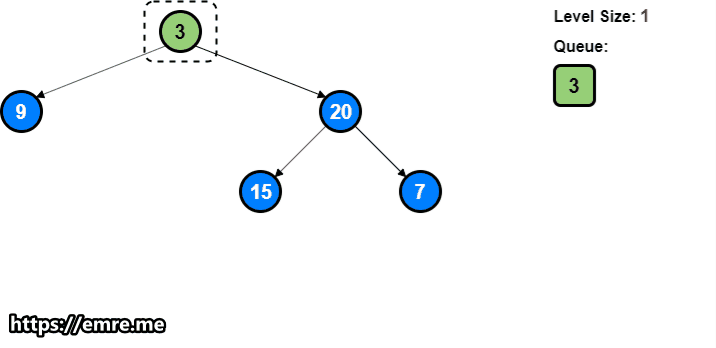

[Article](https://emre.me/coding-patterns/breadth-first-search/)

This approach is quite useful when dealing with the problems involving traversal of a tree in a level-by-level order.

Time Complexity: O(N) where N is the total number of nodes in the tree.

Space Complexity: O(N), since we need an O(N) space to return the result. We will also need O(N) for the queue.

