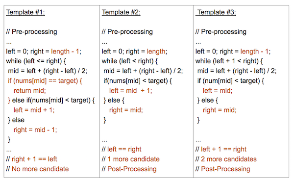

[Article](https://leetcode.com/explore/learn/card/binary-search/136/template-analysis/935/)

Template ` (left <= right) `:

* Search Condition can be determined without comparing to the element's neighbors (or use specific elements around it)
* No post-processing required because at each step, you are checking to see if the element has been found. If you reach the end, then you know the element is not found

Template ` (left < right) `:

* Search Condition needs to access element's immediate right neighbor
* Use element's right neighbor to determine if condition is met and decide whether to go left or right
* Gurantees Search Space is at least 2 in size at each step
* Post-processing required. Loop/Recursion ends when you have 1 element left. Need to assess if the remaining element meets the condition.

Template ` (left + 1 < right) `:

* Search Condition needs to access element's immediate left and right neighbors
* Use element's neighbors to determine if condition is met and decide whether to go left or right
* Gurantees Search Space is at least 3 in size at each step
* Post-processing required. Loop/Recursion ends when you have 2 elements left. Need to assess if the remaining elements meet the condition.

Time Complexity: O(log n)
Space Complexity: O(1)

