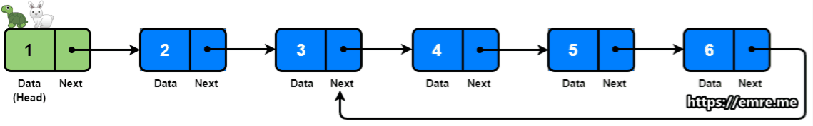

[Article](https://emre.me/coding-patterns/fast-slow-pointers/)

When the problem involves something related to cyclic data structures, you should think about Fast & Slow Pointers pattern

Time Complexity: O(N)
Space Complexity: O(1)

