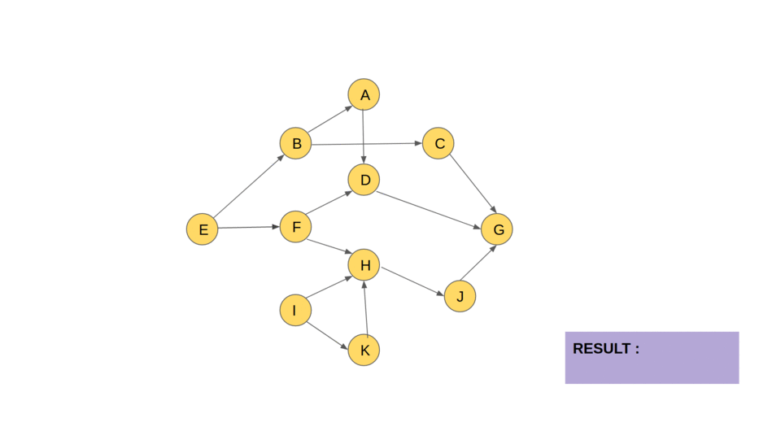

[Article1](https://emre.me/coding-patterns/topological-sort/)

[Article2](https://www.geeksforgeeks.org/topological-sorting/)

Topological sorting for Directed Acyclic Graph (DAG) is a linear ordering of vertices such that for every directed edge u v, vertex u comes before v in the ordering. Topological Sorting for a graph is not possible if the graph is not a DAG.
The ordering of the nodes in the array is called a topological ordering.
Note: this isn't the only way to produce a topological ordering.

Topological Sort pattern is very useful for finding a linear ordering of elements that have dependencies on each other.
Scheduling or grouping problems which have dependencies between items are good examples to the problems that can be solved with using this technique.

PseudoCode:

    L ← Empty list that will contain the sorted nodes
    while exists nodes without a permanent mark do
        select an unmarked node n
        visit(n)

    function visit(node n)
        if n has a permanent mark then
            return
        if n has a temporary mark then
            stop   (not a DAG)

        mark n with a temporary mark

        for each node m with an edge from n to m do
            visit(m)

        remove temporary mark from n
        mark n with a permanent mar

Time Complexity: O(V + E) where E is the number of edges, V number of vertices

Space Complexity: O(V)

