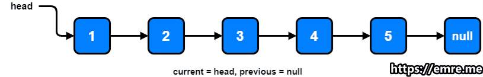

[Article](https://emre.me/coding-patterns/in-place-reversal-of-a-linked-list/)

This approach is quite useful when dealing with reversal of Linked Lists when there is a constraint to do it without using extra memory.

When the problem gives this constraint and Linked Lists data structure, you should think about In-place Reversal of a Linked List pattern.

Time Complexity: O(N)
Space Complexity: O(1)

