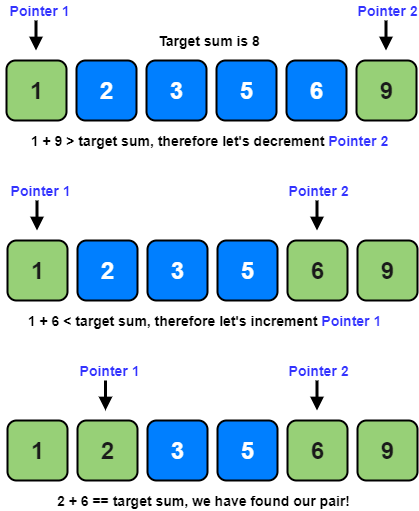

[Article](https://emre.me/coding-patterns/two-pointers/)

The problem involve sorted arrays (or Linked Lists), a set of pair elements, or a triplet or even a subarray.
There is a target value to match or duplicates to be removed.

Time Complexity: O(N)
Space Complexity: O(1)

